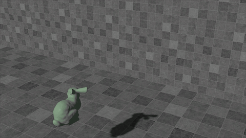
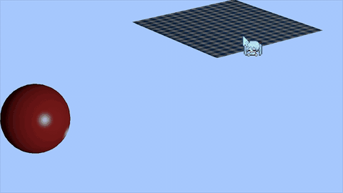
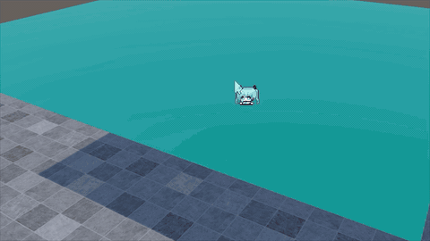
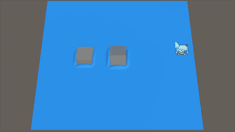

# GAMES103 Homework

This repository collects the homework materials for GAMES103. Each lab is stored as a separate package set, with a starter Unity package, a completed reference package, and a PDF handout. The repository itself is not a full Unity project; instead, it serves as a compact archive of assignment assets that can be imported into fresh Unity projects lab by lab.

## Repository Structure

```text
.
|-- lab1/
|   |-- bunny.unitypackage
|   |-- bunny_complete.unitypackage
|   `-- lab1.pdf
|-- lab2/
|   |-- cloth.unitypackage
|   |-- cloth_complete.unitypackage
|   `-- lab2.pdf
|-- lab3/
|   |-- house.unitypackage
|   |-- house_complete.unitypackage
|   `-- lab3.pdf
`-- lab4/
    |-- wave.unitypackage
    |-- wave_complete.unitypackage
    `-- lab4.pdf
```

## Overview

| Experiment | Algorithms | Objectives |
| --- | --- | --- |
| Lab 1 | Rigid body dynamics, impulse-based collision response, shape matching. | Implement a rigid body solver for the bunny, including translational and rotational motion, collision handling. |
| Lab 2 | Implicit cloth integration, spring-mass modeling, diagonalized Newton-style optimization, Chebyshev acceleration, position-based dynamics. | Build a numerically stable cloth simulator and handle interactions between the cloth and a moving sphere. |
| Lab 3 | Finite element method, St. Venant-Kirchhoff elasticity, Laplacian smoothing, explicit time integration. | Simulate an elastic tetrahedral house model by computing internal elastic forces and stabilizing motion under gravity and floor contact. |
| Lab 4 | Shallow wave simulation, finite difference update, Neumann boundary conditions, conjugate gradient solver, one-way or two-way coupling. | Simulate pool ripples on a height field and couple the water surface with moving blocks to produce interaction-driven waves. |

Recommended workflow:

1. Read the PDF for the target lab first.
2. Create a clean Unity project for that lab only.
3. Import the starter `.unitypackage` through `Assets > Import Package > Custom Package...`.
4. Complete the implementation and verification inside Unity.
5. Use the completed package only as a reference, preferably in a separate project.

## Lab 1

Lab 1 is organized around the bunny scene.




## Lab 2

Lab 2 is organized around the cloth scene.




## Lab 3

Lab 3 is organized around the house scene.




## Lab 4

Lab 4 is organized around the wave scene.




## Notes

- There is no shared `Assets`, `Packages`, or `ProjectSettings` directory at the repository root.
- Each lab should be imported and developed separately in Unity.
- If you want to extend this repository later, a good next step is to add reports, screenshots, source exports, or implementation notes under each lab directory.

